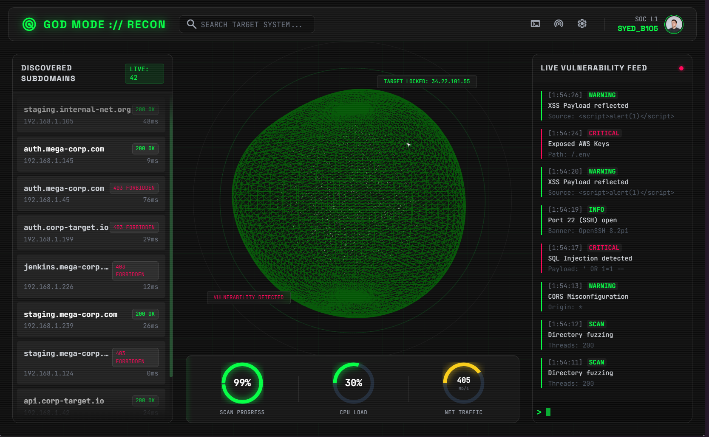

# GOD MODE // RECON DASHBOARD

   

> *Situational awareness for the modern bug bounty hunter.*



## 📡 Transmission
**God Mode // Recon** is a high-fidelity "Concept UI" prototype designed for cybersecurity operations. It visualizes active reconnaissance data, vulnerability logs, and network traffic in a cinematic, "Hollywood-style" interface.

Inspired by the **RonDesignLab** aesthetic and built using a "Vibe Coding" workflow (AI-assisted development), this project bridges the gap between functional React code and high-end motion design.

## 🛡️ Key Modules

### 1. The Core (3D Visualizer)
* **Tech:** `react-three-fiber` + `drei`
* **Function:** A real-time rotating wireframe globe representing the target infrastructure.
* **Visuals:** Includes particle swarms and "glitch" shaders to simulate active hacking attempts.

### 2. Live Intel Feed (Reactive Data)
* **Tech:** Custom `useReconData` Hook
* **Function:** Simulates a live connection to scanning tools (Nmap/Nikto).
* **Features:**
    * Auto-scrolling vulnerability logs.
    * Dynamic subdomain discovery list.
    * Real-time latency and status code updates.

### 3. System Telemetry (HUD)
* **Tech:** SVG-based circular gauges.
* **Function:** Visualizes CPU Load, Network Traffic, and Scan Progress.
* **Detail:** Gauges use reactive `stroke-dasharray` animations to reflect live metric fluctuations.

### 4. CRT Immersion
* **Tech:** CSS Keyframe Animations
* **Effect:** A custom `scanline` overlay and phosphor-glow gradients that give the UI a tactile, retro-futuristic CRT monitor feel.

## ⚡ Quick Start

### Prerequisites
* Node.js (v18+)
* npm or yarn

### Installation

1.  **Clone the repository:**
    ```bash
    git clone [https://github.com/yourusername/recon-dashboard.git](https://github.com/yourusername/recon-dashboard.git)
    cd recon-dashboard
    ```

2.  **Install dependencies:**
    ```bash
    npm install
    # Installs React, Three.js, R3F, Drei, and Tailwind
    ```

3.  **Run the mission:**
    ```bash
    npm run dev
    ```

4.  **Access:**
    Open `http://localhost:5173` to view the dashboard.

## 📂 Project Structure

```text
src/
├── components/
│   └── CyberGlobe.tsx    # The 3D R3F Component
├── hooks/
│   └── useReconData.ts   # The "Game Engine" simulating live data
├── Dashboard.tsx         # Main Layout & UI Assembly
├── index.css             # Tailwind imports & CRT Scanline CSS
└── main.tsx              # Entry point
```

## 🎨 Design System
* **Font:** JetBrains Mono (Data), Space Grotesk (Headers)
* **Palette:**
    * `#00ff41` (Matrix Green) - Safe/Active
    * `#ff0055` (Cyber Red) - Critical/Alert
    * `#0a0a0a` (Void Black) - Background

## 🤝 Credits & Vibe
* **Design Inspiration:** [RonDesignLab](https://dribbble.com/RonDesignLab) (Splunk/DroneOps Concepts).
* **Workflow:** Built using the "Stitch -> Antigravity" AI-assisted pipeline.

##
_Created by syedmuhdhafidz_